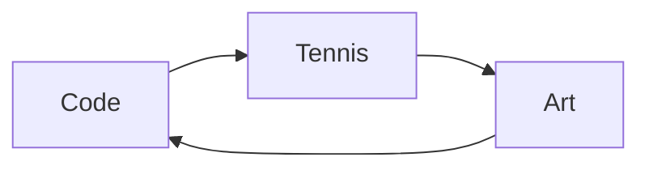

---
# the default layout is 'page'
icon: fas fa-info-circle
order: 4
math: true
mermaid: true
---
<!-- 
> Add Markdown syntax content to file `_tabs/about.md`{: .filepath } and it will show up on this page.
{: .prompt-tip }

> What can I say lol
{: .prompt-tip } -->

Hey there, I'm [Your Name], and welcome to my developer blog! 🚀

I'm a passionate software developer at [Microsoft], where I'm crafting code, solving complex problems, and making an impact in the tech world. With a strong foundation in algorithms and competitive programming, I'm proud to be a [Master at Codeforces](https://codeforces.com/profile/kumaraditya1999), constantly pushing the boundaries of my problem-solving skills.

Beyond the world of tech, I have another life—I'm a national-level tennis player 🎾. On the court, I've learned the value of discipline, perseverance, and the thrill of competition. These qualities spill over into my work as a software engineer, where I'm always striving for excellence.

When I'm not immersed in code or battling it out on the tennis court, you can find me with a sketchbook and paintbrush in hand. I'm an avid sketcher and painter 🎨, finding inspiration in the beauty of the world and channeling it onto canvas.

## What You'll Find Here

This blog is my digital playground, where I share my insights, experiences, and discoveries in the world of software development. Expect to find:

- 🧠 In-depth articles on coding, algorithms, and best practices.
- 🌐 Explorations of the latest tech trends and tools.
- 💡 Tips for acing coding interviews and staying up-to-date in this fast-paced industry.
- 🎮 Fun projects, coding challenges, and open-source contributions.
- 📚 A little sprinkle of my personal journey and reflections on life as a developer.

I'm a firm believer in the power of knowledge sharing and learning together, so don't hesitate to reach out, comment, or connect with me on [Linkedin](https://www.linkedin.com/in/kumaraditya1999/) and [GitHub](https://github.com/kumaraditya1999). Let's embark on this coding adventure together!

